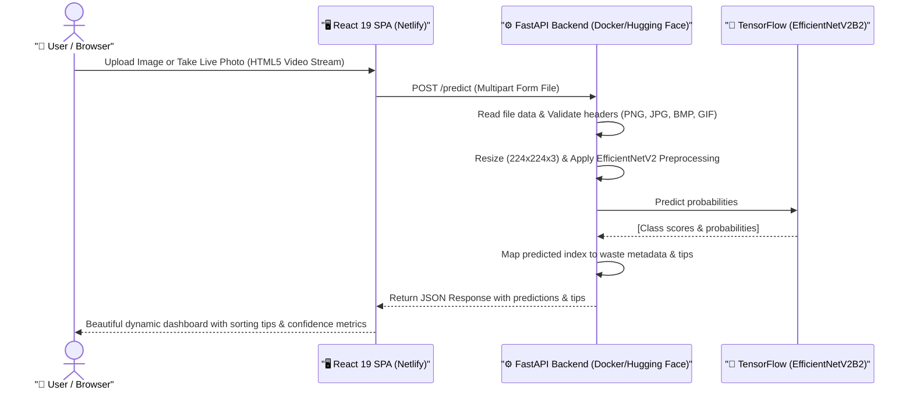

# ♻️ AI-Powered Garbage Classifier & Waste Sorting Platform

An industry-grade, modernized, split-architecture full-stack deep learning application for automated garbage classification and waste management education. The system leverages state-of-the-art **Transfer Learning with EfficientNetV2B2** to classify waste items from images and provide actionable recycling tips to users.

🔗 **[Live Demo: Garbage Classification Platform](https://garbage-classification-frontend.netlify.app/)**

---

## 🗺️ System Architecture

The application is built on a clean, modern, decoupled microservice-style split architecture:



---

## 🌟 Key Features

*   **🎨 Premium React 19 SPA**: Mobile-first user interface featuring gorgeous dark/light themes, smooth scrolling, micro-animations, and glassmorphic dashboards.
*   **📸 Live Camera Shutter Capture**: Stream live camera video directly in the browser and capture waste items using a responsive native shutter trigger.
*   **⚖️ Symmetrical Sizing Layout**: Workspace cards are strictly height-locked (`360px` on mobile, `440px` on desktop) to ensure elegant transitions with zero resizing shifting.
*   **⚡ High Performance FastAPI Backend**: Asynchronous endpoints, CORS-enabled middleware, file safety checks, and EfficientNetV2B2 tensor scaling.
*   **📂 Multi-channel Upload Options**: Drag-and-drop zone, standard browser file uploads, and a quick-test sandbox with realistic pre-configured image presets.

---

## 🧠 Model Specifications & Classes

*   **Base Deep Learning Model**: EfficientNetV2B2 (Pre-trained on ImageNet with fine-tuned top layers).
*   **Input Dimension**: `(224, 224, 3)` (RGB)
*   **Loss & Training**: Optimizer-scheduled training tracking cross-entropy checkpoints (`best_model_finetuned224.keras`).

### 📦 Supported Categories & Recycling Intelligence:

| Icon | Category | Recyclable? | Example Waste Items | Actionable Disposal Tips |
| :---: | :--- | :---: | :--- | :--- |
| **📦** | **Cardboard** | ✅ Yes | Shipping boxes, cereal boxes, pizza boxes | Remove tape and flatten boxes. Clean cardboard recycles better. |
| **🍶** | **Glass** | ✅ Yes | Wine bottles, mason jars, glass containers | Remove lids and rinse clean. Clear glass has the highest value. |
| **🥫** | **Metal** | ✅ Yes | Aluminum cans, tin foil, metal containers | Rinse food residue. Aluminum recycles infinitely. |
| **📄** | **Paper** | ✅ Yes | Newspapers, office paper, magazines | Keep paper dry and clean. Remove staples and plastic window envelopes. |
| **🧴** | **Plastic** | ✅ Yes | Water bottles, plastic bags, food containers | Check recycling number. Clean containers and remove caps. |
| **🗑️** | **Trash** | ❌ No | Food waste, contaminated items, mixed materials | Items too contaminated or made of mixed materials go to regular trash. |

---

## 📂 Project Structure

```text
Garbage-Classification/
├── backend/                   # AI Service Engine (Python/FastAPI)
│   ├── main.py                # FastAPI endpoints & CORS config
│   ├── model.py               # ML Logic & Inference pipeline
│   ├── requirements.txt       # Production dependencies
│   └── best_model_finetuned224.keras
├── frontend/                  # React Single Page App (Vite / TSX)
│   ├── src/
│   │   ├── components/        # Theme & Layout modules (Navbar, Footer)
│   │   ├── views/
│   │   │   ├── Home.tsx       # UX-optimized Landing Page
│   │   │   └── Classifier.tsx # Real-time AI Analysis & Live Camera View
│   │   └── App.tsx            # Navigation & global Routing
│   ├── public/                # Local public assets (Icons, images)
│   ├── .env                   # Environment-driven API config
│   └── tsconfig.json          # TypeScript configurations
├── Dockerfile                 # Root-level Docker build script (HF Spaces)
├── netlify.toml               # Automatic Netlify deploy configurations
└── README.md                  # Developer Documentation
```

---

## ⚙️ Local Development & Setup

### 🔌 Running the FastAPI Backend Locally
1. Navigate to `backend/` and activate a virtual environment:
   ```bash
   cd backend
   python -m venv .venv
   # Windows:
   .venv\Scripts\Activate.ps1
   # macOS/Linux:
   source .venv/bin/activate
   ```
2. Install Python dependencies:
   ```bash
   pip install -r requirements.txt
   ```
3. Run the development server:
   ```bash
   uvicorn main:app --reload --port 8000
   ```

### 🖥️ Running the React Frontend Locally
1. Navigate to `frontend/` and install node modules:
   ```bash
   cd frontend
   npm install
   ```
2. Setup environment variable (create a `.env` file in `frontend/`):
   ```env
   VITE_API_URL=http://localhost:8000
   ```
3. Run the client application:
   ```bash
   npm run dev
   ```

---

## 🐳 Deployment & Cloud Integration

*   **Backend (Hugging Face Spaces)**: Built automatically using the root-level [Dockerfile](Dockerfile) through the Hugging Face Docker SDK, running securely under non-root permissions on port `7860`.
*   **Frontend (Netlify)**: Fully automated deployment via [netlify.toml](netlify.toml). Includes global SPA redirects (`/* -> /index.html 200`) preventing any router 404 page refresh issues.

---

## 👨‍💻 Developer & Team
*   **Principal Developer**: **Shanmugaraj** (Aspiring Python Full Stack Developer | AI Enthusiast)
*   **Co-Developer**: Developed in pair programming with **Antigravity (by Google DeepMind)**, implementing industry-standard methodologies for asynchronous APIs, Tailwind styling, and reactive interface bindings.

*Helping clean the planet, one pixel at a time.* 🌍
