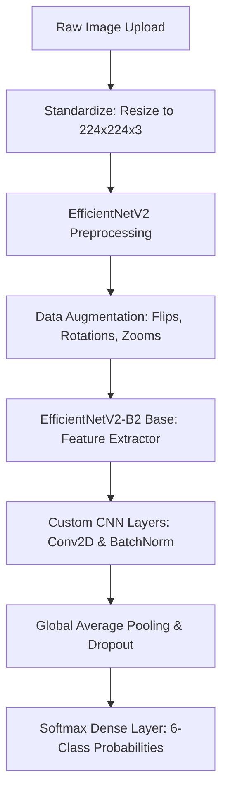

# 🧠 Garbage Classifier - Deep Learning Model Documentation

Hey there! If you want to understand how our AI actually "sees" and classifies garbage under the hood, you are in the correct place. 

This document explains our complete machine learning pipeline—from raw images to deep neural net predictions. We designed a state-of-the-art, **two-stage Transfer Learning and Fine-Tuning architecture** using **EfficientNetV2-B2** and custom convolutional layers. Let's break it down!

---

## 🗺️ Machine Learning Pipeline Overview

Our model goes through an elegant multi-step journey:



---

## 📊 Dataset & Class Distribution

Our model is trained on the **TrashType Image Dataset**, which consists of high-quality images of waste items categorized into 6 distinct classes:
1. **📦 Cardboard**
2. **🍶 Glass**
3. **🥫 Metal**
4. **📄 Paper**
5. **🧴 Plastic**
6. **🗑️ Trash** (Non-recyclable / General waste)

### ⚖️ Handling Class Imbalance
In the real world, waste collection datasets are rarely balanced (e.g., you might have many more photos of plastic bottles than metal cans). To prevent the AI from becoming biased toward the majority classes, we dynamically calculate **balanced class weights** at training time:
```python
from sklearn.utils.class_weight import compute_class_weight

class_weights_array = compute_class_weight(
    class_weight='balanced',
    classes=np.arange(len(class_names)),
    y=training_labels
)
```
These weights act as a multiplier in our loss function—meaning the model is penalized more heavily if it misclassifies rarer waste items, forcing it to learn features for all classes equally.

---

## 🏗️ Neural Network Architecture

We didn't just throw standard layers together. We built a high-performance hybrid model using a **two-phase training strategy**:

### 1. Base Feature Extractor: EfficientNetV2-B2
* **Why EfficientNetV2?** Developed by Google, EfficientNetV2 uses neural architecture search to find the optimal scaling of network depth, width, and resolution. It achieves extremely high accuracy with much faster training times and smaller model sizes compared to legacy models like ResNet or VGG.
* **Weights:** Initialized with weights pre-trained on `imagenet` (millions of general-world images), giving our model pre-existing knowledge of edges, shapes, textures, and lighting.

### 2. Surgical Custom CNN Layers (Our Secret Sauce!)
For our advanced fine-tuning stage, instead of just training the default dense layers, we appended surgical **custom 2D convolutional and batch normalization layers** directly on top of the pre-trained feature extractor:
```python
layers.Conv2D(64, (3, 3), activation='relu', padding='same'),
layers.BatchNormalization(),
layers.Conv2D(32, (3, 3), activation='relu', padding='same'),
layers.BatchNormalization(),
layers.GlobalAveragePooling2D(),
layers.Dropout(0.4),
layers.Dense(6, activation='softmax')
```
* **Why do this?** The pre-trained base model extracts generic features, but our custom `Conv2D` layers specifically re-group those features into spatial patterns representing waste items (like the round rims of glass bottles or the flat, corrugated edges of cardboard boxes).
* **Batch Normalization:** Standardizes inputs between layers, preventing gradient explosions and allowing the custom CNN layers to stabilize and converge rapidly.
* **Dropout (0.4):** Randomly zeroes out 40% of the neurons during training, acting as a powerful regularizer to prevent overfitting.

---

## 🔁 Two-Stage Training & Fine-Tuning Strategy

To get the maximum possible accuracy, we train the model in two distinct phases:

### Phase 1: Base Transfer Learning (`best_model224.keras`)
* **Goal:** Teach the model to map general features to garbage categories without disrupting the base model's pre-trained knowledge.
* **Freezing:** We freeze the early feature-detection layers (`base_model.layers[:100]`) to protect them.
* **Learning Rate:** We use a moderate learning rate of `1e-4` using the `Adam` optimizer.
* **Goalposts:** We save the best-performing model parameters dynamically under `best_model224.keras`.

### Phase 2: Deep Fine-Tuning & Custom CNN Integration (`best_model_finetuned224.keras`)
* **Goal:** Perform surgical adjustments to the base model's deeper weights while training our custom CNN layers.
* **Wider Unfreezing:** We widen the training scope by unfreezing layers down to index `75` (`base_model.layers[:75]` stay frozen), making more specialized feature layers trainable.
* **Micro Learning Rate:** We drop the learning rate to `1e-5` (10x slower!). This ensures that the optimizer makes only tiny, delicate tweaks to the pre-existing weights, avoiding "catastrophic forgetting."
* **Conditional Safety Saving:** We use a custom callback `ConditionalSave` that *only* saves the fine-tuned weights if the validation accuracy strictly exceeds the previous stage's record. This guarantees that our final model is mathematically proven to be our absolute best.

---

## 🛠️ Model Parameters & Config Checklist

* **Image Input Size:** `224x224` pixels, 3 color channels (RGB)
* **Optimization Function:** `Adam`
* **Loss Function:** `sparse_categorical_crossentropy` (best for integer class indices)
* **Patience Settings:** Early Stopping with a patience of `10` epochs to prevent overfitting
* **Data Augmentation:** Real-time random horizontal flips, 10% rotations, 10% zooms, and 10% contrast adjustments to make the model robust against messy real-world backgrounds!

---

## 📈 Running the Model locally

If you want to train the model yourself or run evaluations on your local machine:

1. **Activate your environment & install packages:**
   ```bash
   cd backend
   pip install -r requirements.txt
   ```
2. **Execute the training script:**
   ```bash
   python model.py
   ```
   *This will run both Phase 1 and Phase 2 training pipelines, outputting summary tables, training logs, accuracy comparison plots, and saving the final `.keras` model weights.*
